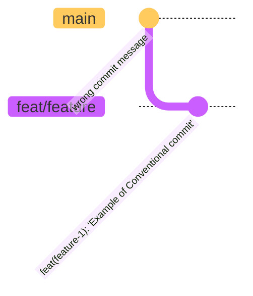
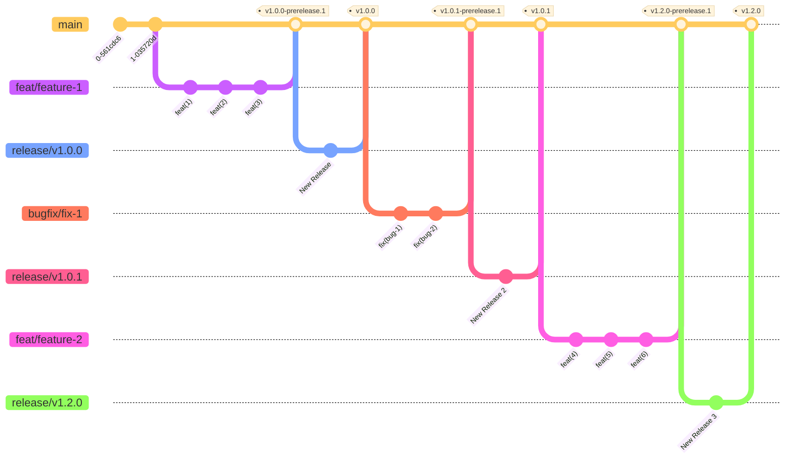

```mermaid
graph TD
    subgraph 4 - Deploy to Production
      subgraph Policy Check
      PC1[Checkout] -->PC2[Get User member]
      PC2 -->PC3[Check if member has right permissions]
      end
      subgraph Generate Manifest
      PC3-->G1
      G1[Set environment variables]-->G2[Extract version X.Y.Z from branch name]
      G2-->G3[Checkout]
      G3-->G4[Authenticate to GCP through workload identity pool]
      G4-->G5[Install gcloud CLI]
      G5-->G6[Configure docker auth]
      G6-->G7[Install helm]
      G7-->G8[Generate manifest file]
      G8-->G9[Set up GKE credentials]
      G9-->G10[Dry run deployment]
      end
      subgraph Deploy to Production
      G10-->D1
      D1[Set environment variables]-->D2[Fetch manifest]
      D2-->D3[Authenticate to GCP through workload identity pool]
      D3-->D4[Set up GKE credentials]
      D4-->D5[K8s Delete and apply deploy/job.yaml if exists]
      D5-->D6[Deploy to kubernetes]
      end
    end
```

# A Reasonably OK Release Workflow with GitHub Actions

*The following was almost entirely written by [@fabio-rigato](https://github.com/fabio-rigato)*

This documents describes an approach to deploying using SemVer release tags to Google Cloud/GKE using Github Actions.

In particular, after reading this document you should be able to:

- Understand how Conventional Commits is integrated
- Understand how Semantic Release is integrated
- Dive into the GitHub Actions (workflows)
  - 1 - PR Build & Scan
  - 2 - Create Pre-release & Deploy to Dev
  - 3 - Create Release
  - 4 - Deploy to Integration
  - 5 - Deploy to Production

## Conventional Commits

The [Conventional Commits](https://www.conventionalcommits.org/en/v1.0.0/) specification is a lightweight convention on top of commit messages. It provides an easy set of rules for creating an explicit commit history; which makes it easier to write automated tools on top of. This convention dovetails with [SemVer](https://semver.org/), by describing the features, fixes, and breaking changes made in commit messages.

The commit message should be structured as follows:

```code
<type>[optional scope]: <description>

[optional body]

[optional footer(s)]
```

The commit contains the following structural elements, to communicate intent to the consumers of your library:

1. **fix**: a commit of the type fix patches a bug in your codebase (this correlates with PATCH in Semantic Versioning).
2. **feat**: a commit of the type feat introduces a new feature to the codebase (this correlates with MINOR in Semantic Versioning).
3. **BREAKING CHANGE**: a commit that has a footer BREAKING CHANGE:, or appends a ! after the type/scope, introduces a breaking API change (correlating with MAJOR in Semantic Versioning). A BREAKING CHANGE can be part of commits of any type.
4. Types other than `fix`: and `feat`: are allowed, for example [@commitlint/config-conventional](https://github.com/conventional-changelog/commitlint/tree/master/%40commitlint/config-conventional) (based on the the [Angular convention](https://github.com/angular/angular/blob/22b96b9/CONTRIBUTING.md#-commit-message-guidelines)) recommends `build:`, `chore:`, `ci:`, `docs:`, `style:`, `refactor:`, `perf:`, `test:`, and others.
5. footers other than `BREAKING CHANGE: <description>` may be provided and follow a convention similar to git trailer format.

Additional types are not mandated by the Conventional Commits specification, and have no implicit effect in Semantic Versioning (unless they include a BREAKING CHANGE). A scope may be provided to a commit’s type, to provide additional contextual information and is contained within parenthesis, e.g., `feat(parser): add ability to parse arrays`.

### Examples

#### Commit message with description and breaking change footer

```code
feat: allow provided config object to extend other configs

BREAKING CHANGE: `extends` key in config file is now used for extending other config files
```

#### Commit message with ! to draw attention to breaking change

```feat!: send an email to the customer when a product is shipped```

#### Commit message with scope and ! to draw attention to breaking change

```feat(api)!: send an email to the customer when a product is shipped```

#### Commit message with both ! and BREAKING CHANGE footer

```code
chore!: drop support for Node 6

BREAKING CHANGE: use JavaScript features not available in Node 6.
```

#### Commit message with no body

```docs: correct spelling of CHANGELOG```

#### Commit message with scope

```feat(lang): add Polish language```

#### Commit message with multi-paragraph body and multiple footers

```code
fix: prevent racing of requests

Introduce a request id and a reference to latest request. Dismiss
incoming responses other than from latest request.

Remove timeouts which were used to mitigate the racing issue but are
obsolete now.

Reviewed-by: Z
Refs: #123
```

### Example of wrong and right commit messages



### Specifications

The key words “MUST”, “MUST NOT”, “REQUIRED”, “SHALL”, “SHALL NOT”, “SHOULD”, “SHOULD NOT”, “RECOMMENDED”, “MAY”, and “OPTIONAL” in this document are to be interpreted as described in [RFC 2119](https://www.ietf.org/rfc/rfc2119.txt).

1. Commits MUST be prefixed with a type, which consists of a noun, `feat`, `fix`, etc., followed by the OPTIONAL scope, OPTIONAL `!`, and REQUIRED terminal colon and space.
2. The type `feat` MUST be used when a commit adds a new feature to your application or library.
3. The type `fix` MUST be used when a commit represents a bug fix for your application.
4. A scope MAY be provided after a type. A scope MUST consist of a noun describing a section of the codebase surrounded by parenthesis, e.g., `fix(parser):`
5. A description MUST immediately follow the colon and space after the type/scope prefix. The description is a short summary of the code changes, e.g., fix: array parsing issue when multiple spaces were contained in string.
6. A longer commit body MAY be provided after the short description, providing additional contextual information about the code changes. The body MUST begin one blank line after the description.
7. A commit body is free-form and MAY consist of any number of newline separated paragraphs.
8. One or more footers MAY be provided one blank line after the body. Each footer MUST consist of a word token, followed by either a `:<space>`or `<space>#` separator, followed by a string value (this is inspired by the [git trailer convention](https://git-scm.com/docs/git-interpret-trailers)).
9. A footer’s token MUST use `-` in place of whitespace characters, e.g., `Acked-by` (this helps differentiate the footer section from a multi-paragraph body). An exception is made for `BREAKING CHANGE`, which MAY also be used as a token.
10. A footer’s value MAY contain spaces and newlines, and parsing MUST terminate when the next valid footer token/separator pair is observed.
11. Breaking changes MUST be indicated in the type/scope prefix of a commit, or as an entry in the footer.
12. If included as a footer, a breaking change MUST consist of the uppercase text BREAKING CHANGE, followed by a colon, space, and description, e.g., BREAKING CHANGE: environment variables now take precedence over config files.
13. If included in the type/scope prefix, breaking changes MUST be indicated by a `!` immediately before the `:`. If `!` is used, `BREAKING CHANGE`: MAY be omitted from the footer section, and the commit description SHALL be used to describe the breaking change.
14. Types other than `feat` and `fix` MAY be used in your commit messages, e.g., docs: updated ref docs.
15. The units of information that make up Conventional Commits MUST NOT be treated as case sensitive by implementors, with the exception of BREAKING CHANGE which MUST be uppercase.
16. BREAKING-CHANGE MUST be synonymous with BREAKING CHANGE, when used as a token in a footer.

### Why Use Conventional Commits

- Automatically generating CHANGELOGs.
- Automatically determining a semantic version bump (based on the types of commits landed).
- Communicating the nature of changes to teammates, the public, and other stakeholders.
- Triggering build and publish processes.
- Making it easier for people to contribute to your projects, by allowing them to explore a more structured commit history.

## Semantic Release

**semantic-release** automates the whole package release workflow including: determining the next version number, generating the release notes, and publishing the package.

This removes the immediate connection between human emotions and version numbers, strictly following the [Semantic Versioning](http://semver.org) specification and communicating the **impact** of changes to consumers.

### How does it work?

#### Commit message format

**semantic-release** uses the commit messages to determine the consumer impact of changes in the codebase.
Following formalized conventions for commit messages, **semantic-release** automatically determines the next [semantic version](https://semver.org) number, generates a changelog and publishes the release.

By default, **semantic-release** uses [Angular Commit Message Conventions](https://github.com/angular/angular/blob/master/CONTRIBUTING.md#-commit-message-format).

The table below shows which commit message gets you which release type when `semantic-release` runs:

| Commit message                                                                                                                                                                                   | Release type               |
| ------------------------------------------------------------------------------------------------------------------------------------------------------------------------------------------------ | -------------------------- |
| `fix(pencil): stop graphite breaking when too much pressure applied`                                                                                                                             | ~~Patch~~ Fix Release      |
| `feat(pencil): add 'graphiteWidth' option`                                                                                                                                                       | ~~Minor~~ Feature Release  |
| `perf(pencil): remove graphiteWidth option``BREAKING CHANGE: The graphiteWidth option has been removed.``The default graphite width of 10mm is always used for performance reasons.` | ~~Major~~ Breaking Release (Note that the `BREAKING CHANGE:` token must be in the footer of the commit) |

## Dive into the GitHub Actions (workflows)

In this chapter the 3 main GitHub workflow are described.
In particular, the 3 workflows will be triggered with in 3 different events.

| Workflow Name               | Trigger       |
|-----------------------------|---------------|
| pull-request-build          | PR created    |
| prerelease-build-and-deploy | PR closed     |
| new-release                 | Manual Action |

### Branching Strategy



The Git graph above, shows how the branching strategy works. In particular, the default branch is the `main` one and features branches (`feat/feat-#`) and bugfix branches (`bugfix/fix-#`) are forked directly from `main`.
Each time a `feat/feat-#` or `bugfix/fix-#` branch has to be merged to `main`, a new PR (Pull Request) has to be created. At this point of time the first workflow `pull-request-build` will be triggered. Once the PR will be closed, the second workflow `prerelease-build-and-deploy` will be executed and a new `pre-release` will be automatically deployed to `develop` cluster.
Another branch type that requires to be mentioned, is the release branch (`release/vX.Y.Z`). In particular, each time a the manual workflow `new-release` will be triggered, a new release will be created and ready to be deployed to a cluster.
In addition, release branches give the ability to schedule releases without disrupting development velocity.

### Workflow `1 - PR Build & Scan`

The `1 - PR Build & Scan` is triggered each time a PR is created or new commits are pushed to a open PR, this workflow is a composition of 2 jobs:

- `commit-lint`
- `build`
- `check`

The aim of `commit-lint` job is to ensure that Conventional Commit Standard is adopted on each commit messages.

The `build` job is mainly responsible to build the Docker images, and generate the manifest file for Kubernetes clusters. In order to recognize the image in the Artifact Registry, and eventually use that image, a Docker tag is generated with the PR number, for example `pr-1`.
`PLEASE NOTE:` Each time new commits will be pushed to an open PR, the previous image in Artifact Registry (AR) will be replaced with the new one, the main reason is to keep the AR as clean as possible because of the high cost.

The `check` job is responsible to scan the image and the manifest file previously generated from virus and  vulnerability using Snyk.

In particular, the following graph describes in details each step in the jobs.

```mermaid
graph TD
    subgraph 1 - PR Build & Scan
      subgraph Conventional Commit Linter
      L1[Checkout]-->L2[Conventional Commit Linter]
      end
      subgraph Build
      L2-->B1
      B1[Set environment variables]-->B2[Checkout]
      B2-->B3[Authenticate to GCP through workload identity pool]
      B3-->B4[Install gcloud CLI]
      B4-->B5[Configure docker auth]
      B5-->B6[Delete previous pr-image from Google Artifacts Registry if exists]
      B6-->B7[Build Docker Image]
      B7-->B8[Publish Image to Artifact Registry]
      B8-->B9[Install helm]
      B9-->B10[Pull helm chart]
      B10-->B11[Generate manifest file]
      B11-->B12["Replace placeholders to job.yaml (if exists)"]
      B12-->B13[Set up GKE credentials]
      B13-->B14[Dry run deployment]
      end
      subgraph Check
      B14-->C1
      C1[Pull Docker to Scan]-->C2[Run Snyk to check Docker image for vulnerabilities]
      C2-->C3[Print Snyk image scan result]
      C3-->C4[Run Snyk to check yaml files]
      C4-->C5[Print Snyk yaml files result]
      end
    end
```



### Workflow `2 - Create Pre-release & Deploy to Dev`

The `2 - Create Pre-release & Deploy to Dev` workflow is triggered automatically each time a PR is closed (accepted).
The main purpose of this workflow is to generate a release candidate (or `pre-release`) and deploy it automatically to the `develop` cluster in order to allow developers to test the new version of the code in place.

The `pre-release` version is automatically generated and managed by `semantic-release` where, based on the previous version (if any, otherwise the default starting version `v1.0.0` will be used as protocol standard) and the conventional commits messages.

The `2 - Create Pre-release & Deploy to Dev` workflow has 4 different jobs:

- `commit-lint`
- `prerelease`
- `build`
- `check`
- `dev_deploy`

The aim of `commit-lint` job is to ensure that Conventional Commit Standard is adopted on each commit messages.

The `prerelease` job is responsible to generate a new prerelease version and push the `TAG` to the `main` branch. An example of prerelease tag is `v1.0.0-prerelease.1`.

The `build` job is mainly responsible to build the Docker images, and generate the manifest file for Kubernetes clusters. The Docker image will have the prerelease tag as a Docker tag.

The `check` job is responsible to scan the image and the manifest file previously generated from virus and  vulnerability using Snyk.

The `dev_deploy` job will deploy to `develop` cluster the new images and the Kubernetes manifest.

The following graph describes in details each step in the jobs:

```mermaid
graph TD
    subgraph 2 - Create Pre-release & Deploy to Dev
      subgraph Conventional Commit Linter
      L1[Checkout]-->L2[Conventional Commit Linter]
      end
      subgraph Prerelease
      L2-->P1
      P1[Checkout]-->P2[Semantic Release]
      P2-->P3[Print info about new pre-release published]
      end
      subgraph Build
      P3-->B1
      B1[Set environment variables]-->B2[Checkout]
      B2-->B3[Authenticate to GCP through workload identity pool]
      B3-->B4[Install gcloud CLI]
      B4-->B5[Configure docker auth]
      B5-->B6[Build Docker Image]
      B6-->B7[Publish Image to Artifact Registry]
      B7-->B8[Install helm]
      B8-->B9[Pull helm chart]
      B9-->B10[Generate manifest file]
      B10-->B11["Replace placeholders to job.yaml (if exists)"]
      B11-->B12[Set up GKE credentials]
      B12-->B13[Dry run deployment]
      end
      subgraph Check
      B13-->C1
      C1[Pull Docker to Scan]-->C2[Run Snyk to check Docker image for vulnerabilities]
      C2-->C3[Print Snyk image scan result]
      C3-->C4[Run Snyk to check yaml files]
      C4-->C5[Print Snyk yaml files result]
      end
      subgraph Dev Deploy
      C5-->D1
      D1[Set environment variables]-->D2[Fetch manifest]
      D2-->D3[Authenticate to GCP through workload identity pool]
      D3-->D4[Set up GKE credentials]
      D4-->D5[K8s Delete and apply deploy/job.yaml if exists]
      D5-->D6[Deploy to develop kubernetes]
      end
    end
```



### Workflow `3 - Create Release`

The `3 - Create Release` workflow is triggered from `manual action ony`. The aim of this workflow is to promote a current pre-release to a new release. During the execution of this workflow a new release branch will also be created containing the source code of the release. In particular, the release branch, will have the following syntax: `release/vX.Y.X`.

The `3 - Create Release` workflow is a composition of 3 jobs:

- `policy-check`
- `release`
- `build`

The `policy-check` job guarantee that only the right people with the right permissions can trigger the manual action. In particular, this job makes sure that the user (actor) is part of the `core-prod-release` GitHub team. Otherwise the workflow will terminate with a permission error message.

The `release` job is responsible to promote the current pre-release to a release. For Example, if the current pre-release is `v1.0.1-prerelease.1` the new release will be `v1.0.1`. Another important task executed by the release job is to create a new release branch containing the release source code. Following the same release example as before, the new branch will be named `release/v1.0.1`. As a last step, a new GitHub release `v1.0.1` will be created.

The `build` job is responsible to build the image with the `v1.0.1` tag and push it to `prod` Artifact Registry.

In particular, the following graph is describing in details each steps for each job.

```mermaid
graph TD
    subgraph 3 - Create Release
      subgraph Policy Check
      PC1[Checkout] -->PC2[Get User member]
      PC2 -->PC3[Check if member has right permissions]
      end
      subgraph Release
      PC3-->R1
      R1[Checkout]-->R2[Semantic Release]
      R2-->R3[Print info about new pre-release published]
      R3-->R4[Check out code]
      R4-->R5[Create release branch]
      R5-->R6[Initialize mandatory git config]
      R6-->R7[Push new branch]
      R7-->R8[Create GitHub Release]
      end
      subgraph Build
      R8-->B1
      B1[Set environment variables]-->B2[Checkout]
      B2-->B3[Authenticate to GCP through workload identity pool]
      B3-->B4[Install gcloud CLI]
      B4-->B5[Configure docker auth]
      B5-->B6[Build Docker Image]
      B6-->B7[Publish Image to Artifact Registry]
      end
    end
```



### Workflow `4 - Deploy to Integration`

The `4 - Deploy to Integration` workflow, is also triggered from a `manual action only` from one of the `feature/vX.Y.Z` features branches. The aim of this workflow is to deploy to integration cluster a particular release.
Since the `feature/vX.Y.Z` features branches are created with the `3 - Create Release` workflow, we are sure that the Docker images were pushed to `prod` Artifact Registry.

This workflow is a composition of 3 jobs:

- `policy-check`
- `generate-manifest`
- `deploy-to-int`

The `policy-check` job guarantee that only the right people with the right permissions can trigger the manual action. In particular, this job makes sure that the user (actor) is part of the `core-prod-release` GitHub team. Otherwise the workflow will terminate with a permission error message.

The `generate-manifest` will generate through Helm template the manifest file for the deployment process.

The `deploy-to-int` process, will apply the YAML manifest file generated in the `generate-manifest` step to the `integration` cluster.

In particular, the following graph describes in details each step of the pipeline:


### Workflow `5 - Deploy to Production`

Same concept as for the integration deployment, the `5 - Deploy to Production` workflow, is also triggered from a `manual action only` from one of the `feature/vX.Y.Z` features branches. The aim of this workflow is to deploy to production cluster a particular release.
Since the `feature/vX.Y.Z` features branches are created with the `3 - Create Release` workflow, we are sure that the Docker images were pushed to `prod` Artifact Registry.

This workflow is a composition of 3 jobs:

- `policy-check`
- `generate-manifest`
- `deploy-to-prd`

The `policy-check` job guarantee that only the right people with the right permissions can trigger the manual action. In particular, this job makes sure that the user (actor) is part of the `core-prod-release` GitHub team. Otherwise the workflow will terminate with a permission error message.

The `generate-manifest` will generate through Helm template the manifest file for the deployment process.

The `deploy-to-prd` process, will apply the YAML manifest file generated in the `generate-manifest` step to the `production` cluster.

In particular, the following graph describes in details each step of the pipeline:


